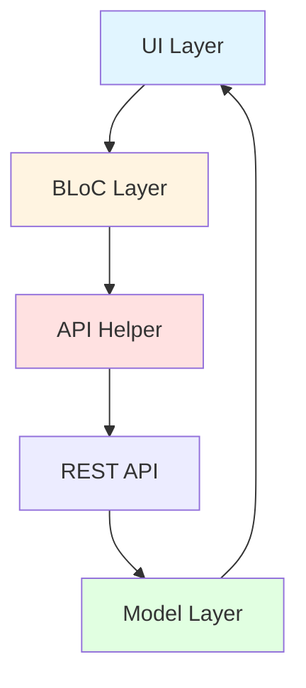
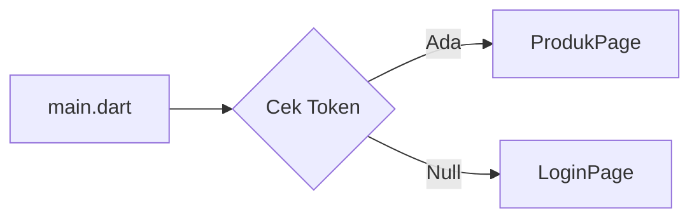
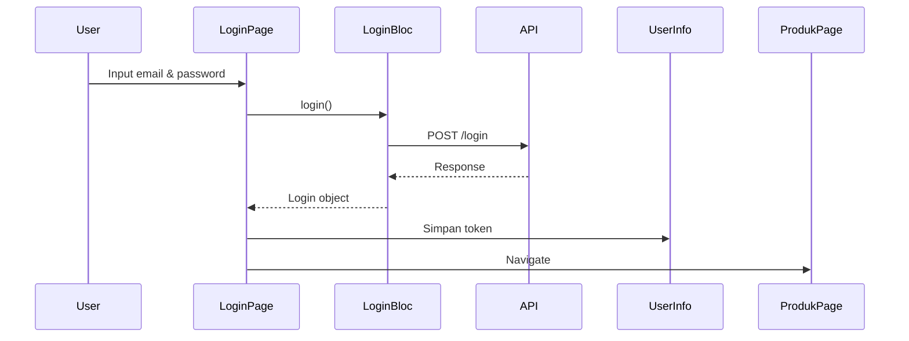

# 🛒 TokoKita - Aplikasi Flutter CRUD Produk

Aplikasi mobile untuk manajemen produk dengan fitur autentikasi (Login & Registrasi) dan operasi CRUD (Create, Read, Update, Delete) produk menggunakan arsitektur BLoC pattern.

---

## 📂 Struktur Folder

```
lib/
├── main.dart                    # Entry point aplikasi
├── bloc/                        # Business Logic Components
│   ├── login_bloc.dart
│   ├── logout_bloc.dart
│   ├── produk_bloc.dart
│   └── registrasi_bloc.dart
├── helpers/                     # Utility & Helper Classes
│   ├── api.dart                 # HTTP Client wrapper
│   ├── api_url.dart             # Endpoint URLs
│   ├── app_exception.dart       # Custom exceptions
│   └── user_info.dart           # Local storage (SharedPreferences)
├── model/                       # Data Models
│   ├── login.dart
│   ├── produk.dart
│   └── registrasi.dart
├── ui/                          # User Interface (Pages)
│   ├── login_page.dart
│   ├── registrasi_page.dart
│   ├── produk_page.dart
│   ├── produk_detail.dart
│   └── produk_form.dart
└── widget/                      # Reusable Widgets
    ├── success_dialog.dart
    └── warning_dialog.dart
```

---

## 🏗️ Arsitektur Aplikasi (BLoC Pattern)



**Penjelasan Layer:**
- **UI Layer**: Tampilan dan interaksi user (Pages & Widgets)
- **BLoC Layer**: Logika bisnis dan komunikasi dengan API
- **API Helper**: HTTP requests dengan auto token injection
- **Model Layer**: Parsing JSON ↔ Dart Object

---

## 🔄 Alur Kode Utama

### 1️⃣ Startup Flow



**File: `main.dart`**
- Cek token di SharedPreferences saat startup
- Jika ada token → langsung ke **ProdukPage**
- Jika tidak → ke **LoginPage**

---

### 2️⃣ Login Flow



**Alur:**
1. User input email & password → validasi form
2. `LoginBloc.login()` → kirim POST request
3. Jika berhasil (code 200):
   - Simpan token & userID ke SharedPreferences
   - Navigate ke ProdukPage
4. Jika gagal → tampilkan WarningDialog

---

### 3️⃣ Registrasi Flow

**Validasi Form:**
- Nama minimal 3 karakter
- Email format valid (regex)
- Password minimal 6 karakter
- Konfirmasi password harus sama

**Alur:**
1. User isi form → validasi
2. `RegistrasiBloc.registrasi()` → POST /registrasi
3. Berhasil → SuccessDialog → kembali ke LoginPage
4. Gagal → WarningDialog

---

### 4️⃣ CRUD Produk

#### **Read (List Produk)**
```dart
// produk_page.dart
FutureBuilder<List>(
  future: ProdukBloc.getProduks(),  // GET /produk
  builder: (context, snapshot) {
    return snapshot.hasData
        ? ListProduk(list: snapshot.data)
        : CircularProgressIndicator();
  },
)
```

#### **Create (Tambah)**
```dart
// produk_form.dart
ProdukBloc.addProduk(produk: createProduk).then((value) {
  Navigator.push(context, MaterialPageRoute(builder: (context) => ProdukPage()));
});
```
→ POST /produk dengan body: `{kode_produk, nama_produk, harga}`

#### **Update (Edit)**
```dart
ProdukBloc.updateProduk(produk: updateProduk).then((value) {
  Navigator.push(context, MaterialPageRoute(builder: (context) => ProdukPage()));
});
```
→ PUT /produk/{id} dengan JSON body

#### **Delete (Hapus)**
```dart
ProdukBloc.deleteProduk(id: produk.id).then((value) {
  Navigator.push(context, MaterialPageRoute(builder: (context) => ProdukPage()));
});
```
→ DELETE /produk/{id}

---

## 🔧 Helper Classes (Inti)

### **API Helper** (`helpers/api.dart`)
Wrapper HTTP client dengan auto Bearer token:
```dart
Future<dynamic> post(dynamic url, dynamic data) async {
  var token = await UserInfo().getToken();
  final response = await http.post(
    Uri.parse(url),
    body: data,
    headers: {HttpHeaders.authorizationHeader: "Bearer $token"}
  );
  return _returnResponse(response);
}
```

### **UserInfo** (`helpers/user_info.dart`)
Mengelola data user di SharedPreferences:
```dart
Future<void> setToken(String value) async { ... }
Future<String?> getToken() async { ... }
Future<void> logout() async { pref.clear(); }
```

### **API URL** (`helpers/api_url.dart`)
Centralized endpoint configuration:
```dart
static const String baseUrl = 'http://localhost:8080';
static const String login = baseUrl + '/login';
static const String listProduk = baseUrl + '/produk';
static String updateProduk(int id) => baseUrl + '/produk/$id';
```

> **Note:** 
> - Chrome/Web: `http://localhost:8080`
> - Android Emulator: `http://10.0.2.2:8080`
> - Physical Device: `http://192.168.x.x:8080`

---

## 📊 State Management Pattern

```dart
void _submit() {
  setState(() { _isLoading = true; });
  
  Bloc.method().then((value) {
    setState(() { _isLoading = false; });  // ✅ Di dalam callback
    // Handle success
  }, onError: (error) {
    setState(() { _isLoading = false; });  // ✅ Di dalam callback
    // Handle error
  });
}
```

⚠️ **Penting:** `setState` untuk reset loading harus **di dalam callback** `.then()`, bukan di luar, karena operasi API bersifat asynchronous.

---

## 🚀 Cara Menjalankan

```bash
# Install dependencies
flutter pub get

# Jalankan di Chrome
flutter run -d chrome

# Jalankan di Android
flutter run -d android
```

**Konfigurasi API:** Edit `lib/helpers/api_url.dart` sesuai backend URL Anda.

---

## 📝 Catatan

### ✅ Pattern yang Digunakan
- **BLoC Pattern** untuk separation of concerns
- **FutureBuilder** untuk async data loading
- **SharedPreferences** untuk local storage
- **Navigator** untuk routing

### 🔄 Flow Request API
```
UI → BLoC → API Helper (+ Token) → Backend → Model → UI
```

---

## 📸 Screenshots

| Login | Registrasi | List Produk | Detail | Form |
|-------|------------|-------------|--------|------|
|  |  |  |  |  |

---

## 📚 Dependencies

```yaml
dependencies:
  flutter:
    sdk: flutter
  http: ^latest
  shared_preferences: ^latest
```

---

**Dibuat untuk pembelajaran Flutter - CRUD & Authentication Pattern** 🎓
