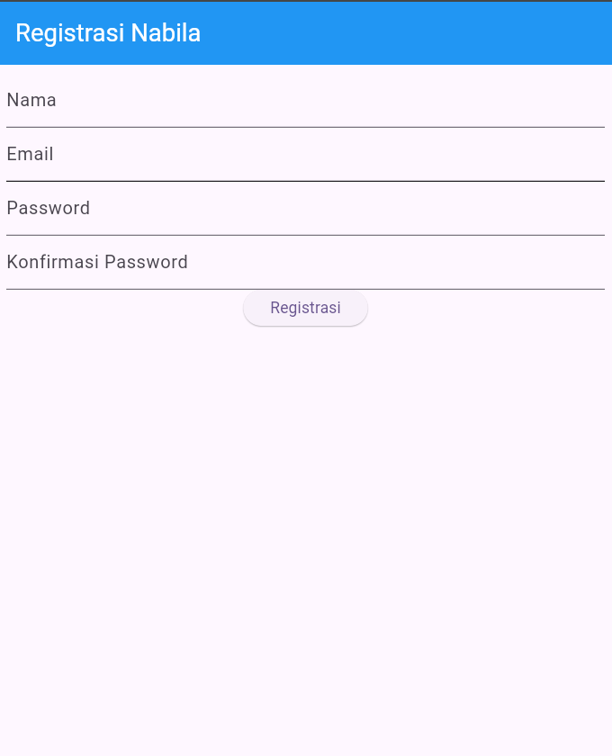
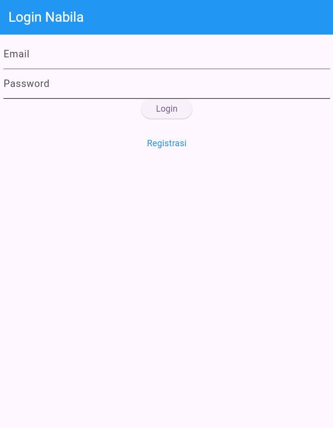
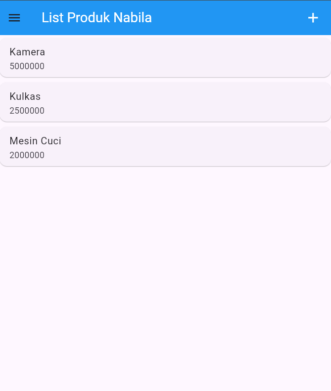
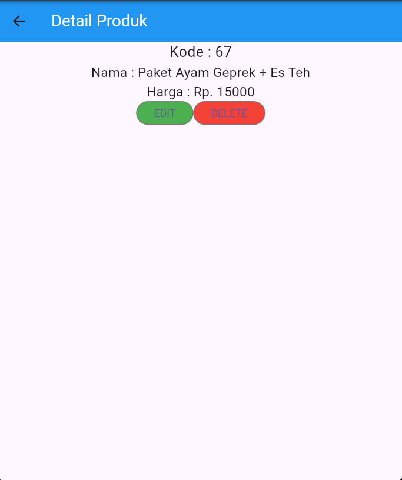
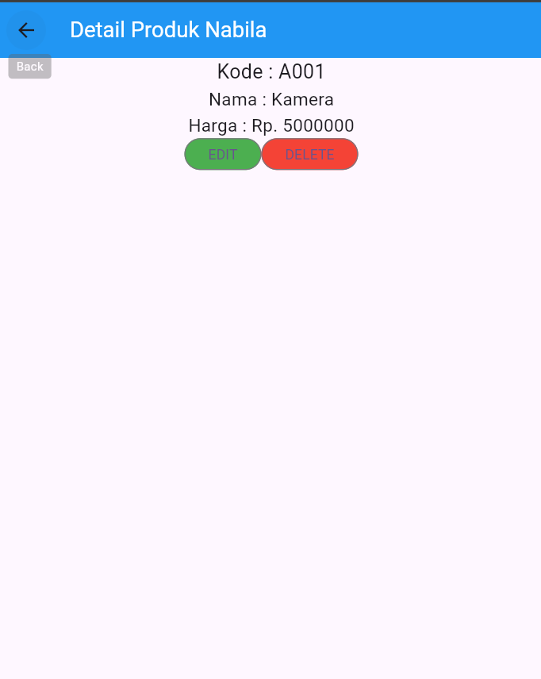

# TokoKita – Aplikasi Flutter CRUD Sederhana

TokoKita adalah aplikasi Flutter sederhana yang menyediakan fitur **Login**, **Registrasi**, serta **CRUD Produk** (Create, Read, Update, Delete).  
Aplikasi ini cocok untuk pembelajaran dasar Flutter seperti penggunaan form, validasi input, navigasi antar halaman, dan penggunaan model sebagai representasi data.

---

## 📂 Struktur Folder

```
lib/
│
├── main.dart
│
├── model/
│ ├── login.dart
│ ├── produk.dart
│ └── registrasi.dart
│
└── ui/
├── login_page.dart
├── registrasi_page.dart
├── produk_page.dart
├── produk_detail.dart
└── produk_form.dart

```
---


---

## 📘 Penjelasan File

---

# 🟦 File Utama

## **main.dart**
File utama yang dijalankan pertama kali.

### Fungsi:
- Menjalankan aplikasi dengan `runApp()`
- Mengatur tema global
- Menentukan halaman awal yaitu **LoginPage**

---

# 🗂️ Folder: model/

Model digunakan sebagai representasi data dari API atau dummy data.

---

## **model/login.dart**
Model untuk data login user.

### Menyimpan:
- `code` — kode response API
- `status` — status request
- `token` — token autentikasi
- `userID` — ID pengguna
- `userEmail` — email pengguna

### Kegunaan:
- Parsing JSON response ketika proses login.

---

## **model/produk.dart**
Model untuk menyimpan data produk.

### Menyimpan:
- `id` — ID produk
- `kodeProduk` — kode unik produk
- `namaProduk` — nama produk
- `hargaProduk` — harga produk

### Kegunaan:
- Memetakan data produk dari json menjadi objek Produk.

---

## **model/registrasi.dart**
Model untuk response registrasi.

### Menyimpan:
- `code`
- `status`
- `data` — pesan atau informasi dari server setelah registrasi

---

# 🖥️ Folder: ui/

Berisi tampilan (halaman) aplikasi.

---

## **ui/login_page.dart**
Halaman login user.

### Fitur:
- Form login (Email + Password)
- Validasi input:
  - Email wajib diisi
  - Password wajib diisi
- Tombol Login (validasi tanpa API)
- Link menuju halaman Registrasi

---

## **ui/registrasi_page.dart**
Halaman registrasi akun baru.

### Fitur:
- Form nama, email, password, konfirmasi password
- Validasi lengkap:
  - Nama minimal 3 karakter
  - Email harus valid (regex)
  - Password minimal 6 karakter
  - Konfirmasi password harus sama

---

## **ui/produk_page.dart**
Halaman untuk menampilkan daftar produk.

### Fitur:
- AppBar + tombol tambah produk
- Drawer dengan tombol Logout
- List produk (masih dummy)
- Klik produk → menuju **ProdukDetail**

---

## **ui/produk_detail.dart**
Halaman detail produk.

### Fitur:
- Menampilkan detail kode, nama, harga
- Tombol **EDIT** →
  membuka `ProdukForm` dengan data produk
- Tombol **DELETE**
  - Menampilkan dialog konfirmasi
  - Fungsi delete API masih dikomentari

---

## **ui/produk_form.dart**
Form tambah/ubah produk.

### Fitur:
- Dapat berfungsi untuk 2 mode:
  - **Tambah produk**
  - **Edit produk**
- Menyesuaikan judul & tombol (Simpan/Ubah) otomatis
- Validasi input:
  - Kode produk wajib
  - Nama produk wajib
  - Harga wajib

---

# Screenshoot Project

|  |  |  |  | 

